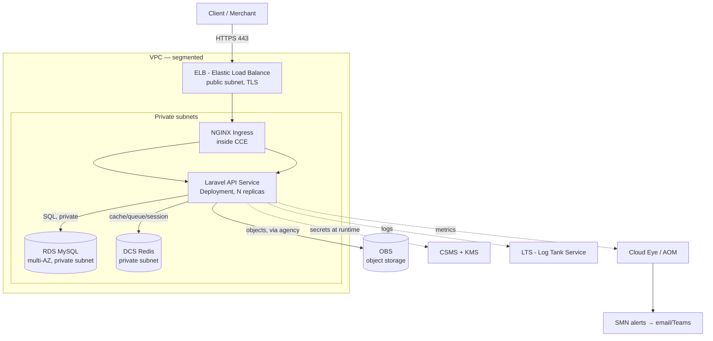

# Architecture — CashOnRails Laravel API on Huawei Cloud

**Author:** Moses Boriowo · **Assessment:** DevOps/Platform Engineer (Final Stage)

> This document explains the production architecture for the supplied Dockerised Laravel REST API, the Huawei Cloud services chosen, the alternatives considered, and the trade-offs. Data-residency, platform-engineering, and reliability details live in their own docs and are only summarised here.

---

## 1. Summary

I deploy the Laravel API as a stateless, containerised workload on **Huawei CCE (managed Kubernetes)**, backed by a **managed RDS database** (replacing SQLite) and **DCS (Redis)** for cache/session/queue. Traffic enters through an **ELB** with TLS, into an **NGINX ingress** inside the cluster. All state lives outside the pods (RDS, DCS, OBS), so pods are disposable and horizontally scalable.

Everything is provisioned with **Terraform** (remote state in **OBS** with locking). Secrets live in **CSMS/KMS**, never in Git or state. All residency-bound data is pinned to a single approved Nigerian location (see the data-residency doc).

The design deliberately favours a **container platform (CCE)** over a single VM because Part 2 requires this to become a **paved road for many services** — the same foundation serves the Laravel API today and a Go service tomorrow with no new infrastructure.

---

## 2. Application runtime analysis

The app is a Dockerised Laravel REST API with automated tests, using **SQLite** for dev/portability. A production Laravel API typically needs:

| Need | Dev (supplied) | Production decision |
|------|----------------|---------------------|
| **Database** | SQLite (single file) | **Replace → RDS (MySQL)** — see §2.1 |
| **Cache / sessions / queue** | file/array driver | **DCS (Redis)** — shared across replicas |
| **File / object storage** | local disk | **OBS** (S3-compatible) via Laravel `Flysystem` |
| **App key & secrets** | `.env` | **CSMS** injected at runtime |
| **Web runtime** | FrankenPHP (built-in) | **FrankenPHP** serves HTTP directly on **:8080** — no separate NGINX/PHP-FPM tier needed |
| **Migrations** | run manually | run as a **CI/CD / init job** before traffic shift |
| **Health probes** | `/api/v1/health`, `/api/v1/ready` | liveness → `/api/v1/health`; **readiness → `/api/v1/ready` (DB check)** — maps cleanly to K8s probes |
| **Logging** | `LOG_CHANNEL=stderr` | logs to stdout/stderr → captured by CCE → shipped to **LTS** (no log files on disk) |

**Verified against the repo (`Cashonrails/my-assessment-api`):** PHP 8.3+, the **FrankenPHP** container serves HTTP on **:8080**, is fully env-var-configurable (`DB_CONNECTION`, `DB_HOST`, …), exposes **`/api/v1/health`** (liveness) and **`/api/v1/ready`** (DB readiness) endpoints, and logs to **stderr**. An existing `.github/workflows/ci.yml` already runs the automated test suite, and an `openapi.yaml` documents the API — both of which I build on rather than replace.

### 2.1 SQLite → managed RDS (required decision)

**Decision: replace SQLite with RDS for MySQL in production.**

SQLite is a single-file, single-writer embedded database. It is unsuitable here because:
- **No horizontal scaling** — multiple API replicas cannot safely share one SQLite file; concurrent writes lock.
- **Not durable in containers** — the file lives in the pod's ephemeral filesystem and is lost on restart/reschedule.
- **No HA, backups, PITR, or replication** — all of which a payment workload requires.

**Managed RDS (MySQL)** gives multi-AZ HA, automated backups + point-in-time recovery, encryption at rest, and connection scaling — while Laravel needs only a driver/env change (`DB_CONNECTION=mysql`), no code changes.
**Trade-off:** RDS adds cost and a network dependency vs. an embedded file; multi-AZ roughly doubles DB cost. Justified for a payments API where data loss or single-writer contention is unacceptable. (Staging can run single-AZ to save cost.)

---

## 3. Traffic flow (high level)

---

## 4. Component design — service choice, alternatives, trade-offs

> Graders explicitly want *why this, what else I considered, and the trade-off.*

### 4.1 Compute / orchestration → **Huawei CCE (managed Kubernetes)**
- **Why:** reuses standard Kubernetes (Deployments, HPA, probes, rolling updates); is the natural foundation for the Part 2 multi-service platform; keeps the workload **cloud-agnostic/portable**, which matters for data-residency flexibility and avoiding lock-in.
- **Alternatives considered:**
  - *ECS + Docker (VMs):* simpler and cheaper for one service, but no orchestration, weak self-healing/scaling, and does **not** generalise into a platform. Rejected.
  - *CCI (serverless containers):* less operational overhead, good for bursty jobs, but less control over networking/scheduling and harder to standardise as a paved road. Kept as an option for batch/queue workers.
- **Trade-off:** CCE carries more operational and cost overhead than a single VM for *one* service — accepted because the brief explicitly asks for a reusable platform, and K8s amortises across many services.

### 4.2 Database → **RDS for MySQL** (see §2.1)
- Multi-AZ, private subnet only, automated backups + PITR, KMS encryption at rest, TLS in transit.
- **Alternative:** self-managed MySQL on ECS (cheaper, full control) — rejected for the operational burden of HA/backups/patching on a payments datastore.

### 4.3 Cache / queue → **DCS (Redis)**
- Shared cache, sessions, and queue backend across replicas (Laravel `redis` driver).
- **Alternative:** database/file drivers — rejected (don't scale across pods).

### 4.4 Networking & segmentation → **VPC with tiered subnets**
- **Public subnet:** ELB + NAT gateway only.
- **Private app subnet:** CCE worker nodes / API pods.
- **Private data subnet:** RDS + DCS — no route to the internet, no public IP.
- **Security groups (least privilege):** ELB→ingress (443), ingress→pods, pods→RDS (3306), pods→DCS (6379). Egress via NAT for image pulls/updates only.
- **Trade-off:** NAT gateway adds cost; justified to keep private workloads off the public internet.

### 4.5 Load balancing, ingress, TLS → **ELB → NGINX ingress + cert**
- ELB terminates/forwards HTTPS in the public subnet; **NGINX ingress** routes to services inside CCE (a skill and pattern I already run in production). TLS via managed certificate (Huawei SCM) or cert-manager + ACME. **HTTP→HTTPS redirect**, HSTS.

### 4.6 Secrets & configuration → **CSMS + KMS**
- App key, DB/Redis credentials, third-party keys stored in **CSMS**, encrypted with **KMS**. Injected into pods at runtime (secret store CSI / init) — **never** in Terraform, container images, or Git. Config that is non-secret comes from ConfigMaps/env.

### 4.7 Identity & access → **IAM + workload identity (agencies)**
- Human/CI IAM users scoped least-privilege. Pods use a Huawei **agency** (workload identity) to reach OBS/CSMS — **no static access keys baked into images**. Separate, tightly-scoped credential for the CI/CD deploy role.

### 4.8 CI/CD → build → test → scan → publish → deploy → verify → rollback
Pipeline stages (detailed in the CI/CD doc):
1. `composer install`, **run the app's automated tests**
2. Build Docker image
3. **Security scans:** image (Trivy), SAST (SonarQube), dependency check
4. Push image to **SWR** (container registry)
5. Infra gate: `terraform fmt -check`, `terraform validate`, `terraform plan`
6. Deploy to CCE (Helm/Argo CD), **run DB migrations**
7. **Smoke test** the health endpoint
8. **Auto-rollback** if probes/smoke fail
- Staging auto-deploys; production requires approval.

### 4.9 Health, readiness, smoke → **probes + post-deploy check**
- **Liveness probe → `/api/v1/health`** (restarts hung pods); **readiness probe → `/api/v1/ready`**, which the app implements as a **database readiness check** — so K8s won't route traffic to a pod until its DB connection is healthy (exactly the behaviour I want after a deploy or DB blip). A post-deploy **smoke test** hits `/api/v1/health` and a real transaction endpoint before the rollout is marked good.

### 4.10 Observability → **LTS + Cloud Eye/AOM + SMN**
- **LTS:** structured (JSON) application and audit logs.
- **Cloud Eye / AOM:** metrics + APM (latency, error rate, pod restarts, DB connections, node CPU/mem/disk).
- **SMN:** alerts to email/Teams on threshold breaches (error rate, p95 latency, restart loops, low disk, DB saturation). *(Directly addresses the log-disk-saturation incident class I've handled before — proactive alerts before the disk fills.)*

### 4.11 Backup & recovery → RDS backups + OBS versioning
- RDS automated backups + PITR (in-region for residency); OBS bucket versioning; Terraform state backed up. **RPO/RTO defined in the reliability doc** (target RPO ≤ 15 min via PITR, RTO ≤ 1 h).

### 4.12 Scalability & HA
- CCE worker nodes across **≥ 2 AZs**; **HPA** for pods, **cluster autoscaler** for nodes; RDS **multi-AZ**; ELB spans AZs. Pods are **stateless** (state in RDS/DCS/OBS), so scaling is horizontal and safe.

### 4.13 Deployment & rollback strategy
- **Rolling updates** gated by readiness probes; **automatic rollback** on failed health/smoke; canary available for higher-risk changes.

### 4.14 Environment separation & Terraform state
- **Separate state per environment** (staging, prod) in **OBS** with **locking + encryption**; identical **modules**, different `tfvars`. Optionally separate VPCs for hard isolation.

---

## 5. Cross-cutting concerns

### 5.1 Security (summary; full detail in security doc)
Private subnets, least-privilege SGs and IAM, TLS everywhere, encryption at rest (KMS) and in transit, secrets in CSMS, image + SAST scanning in CI, no public database, audit logging via **CTS (Cloud Trace Service)**.

### 5.2 Cost drivers & cost-conscious choices
- **Main drivers:** CCE control plane + worker nodes, RDS (multi-AZ ≈ 2×), ELB, NAT gateway, OBS, inter-AZ/egress data transfer.
- **Cost-conscious choices:** right-sized nodes; **single-AZ RDS + smaller nodes in staging**; scale non-prod to zero out of hours; OBS lifecycle rules for old logs/backups; one shared NAT.
- Per the brief, this is **not a full production-sized deployment** — I favour engineering quality and clear trade-offs over spend, and document what I'd scale up in production.

### 5.3 Data residency (summary; full detail in residency doc)
Huawei operates a **local data centre in Nigeria**, so residency-bound data is kept **in-country on Huawei Cloud** — a hybrid/on-prem fallback is a contingency, not the primary approach. Every residency-bound data class — customer/transaction DB, its backups/snapshots, PII-bearing logs, monitoring/telemetry, secrets/keys, container images, DR copies, and **Terraform state** — is pinned to the Nigerian location.

The real work (and what the brief tests) is **verifying per-service availability in the Nigerian DC**: not every managed service is guaranteed to run there, and some — monitoring/telemetry, the secret/key store, the image registry — can store metadata or copies *outside* the country by default. The residency doc contains a **data-class × Huawei-service × confirmed-in-Nigeria?** matrix; any service I cannot confirm runs in-country is documented as a **gap with an in-country mitigation**, never assumed compliant.

---

## 6. Assumptions & open questions (stated, not hidden)
1. ✅ **Verified:** FrankenPHP container serves HTTP on **:8080**, fully env-var-configurable, logs to stderr.
2. ✅ **Verified:** app ships **`/api/v1/health`** + **`/api/v1/ready`** (DB-aware) — used directly as probes. Switching SQLite→RDS is a **config-only change** (`DB_CONNECTION=mysql` + host/creds); Laravel migrations are DB-agnostic, so they run unchanged against RDS.
3. **Per-service availability in the Nigerian data centre** — Huawei has an in-country DC, so residency is achievable in-cloud; the open question is *which specific managed services* (RDS, OBS, DCS, CCE, CSMS/KMS, LTS, Cloud Eye, SWR) actually run there vs. only in a larger region (e.g. Johannesburg). Verified per-service in the residency doc; any unavailable service gets an in-country mitigation.
4. Sessions are token-based (stateless API); if server sessions are used, they go to DCS.
5. Prod-sized capacity numbers (replica counts, node sizes) are illustrative and tuned from load testing in a real engagement.

---

## 7. What I'd add with more time (production hardening)
- Service mesh (mTLS between services) as the platform grows.
- Progressive delivery (canary/blue-green) via Argo Rollouts.
- Policy-as-code (OPA/Gatekeeper) for security guardrails (ties into Part 2).
- Full DR runbook with periodic restore drills.
- Cost dashboards + anomaly alerts.
